# [Studio Ghibli Quiz](https://desireealexia.github.io/studio-ghibli-quiz/)

The Studio Ghibli Quiz Website is an interactive platform designed to test and expand your knowledge of Studio Ghibli films. Aimed at fans of the studio's iconic movies, this project offers a fun and engaging quiz experience with a variety of question types, including multiple-choice, true/false, and image-based questions.

Targeted towards both casual viewers and dedicated enthusiasts, the quiz provides an opportunity to deepen your appreciation for Studio Ghibli's enchanting worlds and memorable characters. Whether you're challenging yourself or simply enjoying the nostalgia, this website offers an entertaining way to connect with the magic of Studio Ghibli.

[View live website here](https://desireealexia.github.io/studio-ghibli-quiz/)

## Table of Contents

- [UX](#ux)
  - [Project Goals](#project-goals)
  - [User Stories](#user-stories)
  - [Design](#design)
  - [Wireframes](#wireframes)
- [Features](#features)
- [Manual Testing](#manual-testing)
  - [Features Testing](#features-testing)
  - [Browser Compatibility](#browser-compatibility)
  - [Responsiveness Testing](#responsiveness-testing)
  - [Accessibility Testing](#accessibility-testing)
  - [Code Validation](#code-validation)
  - [Bugs](#bugs)
  - [Lighthouse Testing](#lighthouse-testing)
- [Deployment](#deployment)
  - [Deployment (GitHub Pages)](#deployment-github-pages)
  - [Local Deployment](#local-deployment)
- [Technologies Used](#technologies-used)
  - [Languages](#languages)
  - [Design & Development Tools](#design--development-tools)
- [Credits](#credits)
  - [Code](#code)
  - [Research and Resources](#research-and-resources)
  - [Media](#media)
  - [Content](#content)

# UX

## Project Goals

- **Engage Users**: Create an interactive and enjoyable quiz experience that appeals to Studio Ghibli fans by offering a variety of challenging and fun questions.
- **Ensure Accessibility**: Design the website to be accessible and responsive, ensuring a seamless experience across all devices, including desktops, tablets, and smartphones.
- **Provide Immediate Feedback**: Implement a scoring system that provides instant feedback on answers, helping users learn and stay engaged throughout the quiz.
- **Maintain Thematic Consistency**: Use Studio Ghibli-inspired design elements, including imagery, colour schemes, and typography, to create a visually appealing and cohesive user experience.

## User Stories

- As a **Studio Ghibli fan**, I want to test my knowledge of Studio Ghibli movies, so that I can see how well I know the films.

- As a **casual visitor**, I want the quiz to be easy to navigate and visually appealing so that I can enjoy the experience without any frustration.

- As a **mobile user**, I want to be able to take the quiz on my phone, so that I can enjoy it wherever I am.

- As a **trivia enthusiast**, I want to see a variety of question types (e.g., multiple-choice, true/false, image-based), so that the quiz stays interesting and challenging.

- As a **user with visual impairments**, I want the website to be accessible, so that I can participate in the quiz just like everyone else.

- As a **user who has completed the quiz**, I want to see my final score and have the option to retake the quiz, so that I can try to improve my score.

## Design

### Colour Palette

The colour palette for the Studio Ghibli Quiz has been carefully selected to create a cohesive and visually appealing design, while also ensuring clarity and accessibility across different elements of the website. Each colour has been purposefully applied to enhance user interaction and reinforce the overall aesthetic.

**#0A3D62 (Indigo Blue):** This deep blue is used for interactive elements, including the hover state of the site's buttons (such as the start and next buttons) and the title on the instruction, about, and contact modals. It also serves as the hover colour for the modal close button and the email link in the contact modal.

**#F8F1E5 (Light Ivory):** This vibrant yellow is employed to draw attention to navigation elements by appearing as the hover colour in the navigation bar. It also adds a subtle visual distinction by underlining the score, separating it from the question section.

**#3A5A40 (Forest Green):** This natural, soothing green colour is used to highlight correct answers, offering positive reinforcement when a user selects the right option.

**#FBC02D (Golden Yellow):** Serving as the primary text colour, this soft ivory hue is used throughout the site for various elements, including the navigation menu, titles, welcome text, footer, score, question text, question count, final score text, and buttons. It is also the colour of the text on hover states for buttons.

**#92272D (Rusty Red):** This strong, earthy red is designated for incorrect answers, providing a clear visual indication when a user selects an incorrect option.

**#3E3E3D (Shadow Slate):** This neutral, dark grey colour is used for text on modals, as well as the text on buttons. It is also the colour of the next button when it is disabled, before the user selects an answer, ensuring a clear visual cue.

### Typography

The quiz utilises **ITC Avant Garde Gothic**, the same font used in the Studio Ghibli logo, to maintain brand consistency and evoke the unique aesthetic of the studio:

- **Headings:** _ITC Avant Garde Gothic Medium_ is used for headings, providing a bold and clear emphasis on key sections.

- **Body Text:** _ITC Avant Garde Gothic Book_ is used for the main text, offering a clean and readable experience for users.

### Imagery

#### Logo and Favicon

For the website's branding, I have chosen a Totoro icon as both the logo and favicon. Totoro, one of the most beloved characters from Studio Ghibli's film My Neighbor Totoro, serves as a recognisable and charming symbol that immediately connects users with the magic of Studio Ghibli. The logo appears prominently in the top-left corner of each page, reinforcing the brand identity, while the favicon provides a small but effective visual cue in the browser tab, helping users easily identify the quiz among their open tabs.

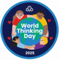

#### Background

To further evoke the whimsical and natural aesthetics characteristic of Studio Ghibli films, the website features a background image of the garden from The Secret World of Arrietty. This lush, vibrant garden setting creates a visually captivating backdrop that complements the overall theme of the quiz. The background imagery not only enhances the visual appeal of the site but also immerses users in the world of Studio Ghibli, aligning with the fantastical and nature-centric elements of the films.

#### Image-Based Questions

The Studio Ghibli Quiz features two image-based questions to enhance user engagement and provide a more interactive experience. These questions incorporate high-quality images from Studio Ghibli films, challenging users to recognise and recall visual details. This approach not only makes the quiz more dynamic but also deepens users' connection to the films. The images are carefully chosen and optimised for various devices, and alternative text descriptions are provided to ensure accessibility for all users. Overall, these visual questions enrich the quiz experience by celebrating the distinctive artistry of Studio Ghibli.

## Wireframes

The following wireframes outline the basic layout and design of the key pages in the Studio Ghibli Quiz website. Each page follows a consistent structure, including a logo, navigation menu, and footer, to ensure a cohesive user experience.

- **Logo:** The Studio Ghibli Quiz logo will appear in the top-left corner of each page, providing consistent branding.
- **Navigation Menu:** Located at the top of each page, the navigation menu will include links to the Home, Quiz, Instructions, About, and Contact pages, allowing users to easily move between sections of the site.
- **Footer:** The footer will appear at the bottom of each page, potentially including copyright information, social media links, and any additional navigation links.

### Home Page

The home page serves as the entry point to the quiz. In the main content area, users are greeted with the title of the quiz prominently displayed at the top. Below the title, a welcoming message introduces the quiz and sets the tone for the experience. A large, easily identifiable button is placed centrally on the page, inviting users to start the quiz. This simple and clear design helps users understand the purpose of the site and encourages them to begin the quiz without any confusion.

### Quiz Page

The quiz page is where the interactive part of the experience takes place. The main content area is dedicated to presenting the current quiz question, which is displayed prominently at the top of the page. Below the question, users will find multiple-choice answers, presented as buttons or selectable options. This layout ensures that the focus remains on the questions and answers, making it easy for users to engage with the quiz. At the bottom of the content area, a "Next" button allows users to proceed to the next question once they have made their selection.

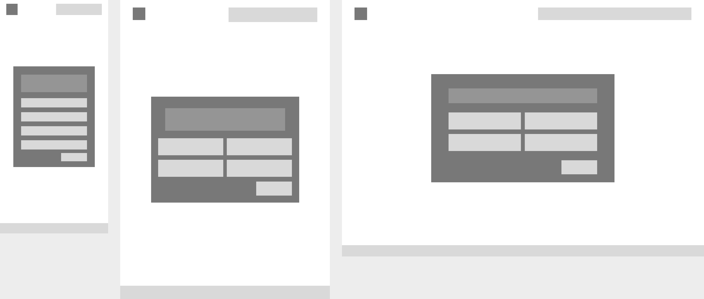

### Instructions and About Pages

The Instructions and About pages share a similar layout, designed to provide users with essential information. In the main content area, the title of the page, such as "Instructions" or "About," is displayed at the top, followed by a block of text. On the Instructions page, this text guides users on how to play the quiz, while the About page offers background information about Studio Ghibli and the quiz itself. This consistent structure ensures that users can easily access and absorb the information they need.

### Contact Page

The Contact page is designed to facilitate communication between users and the quiz creators. The main content area includes a title at the top, followed by a brief piece of text inviting users to reach out with any questions or feedback. Below this text, a simple contact form is provided, which includes fields for the user’s name, email address, and message. A submit button at the bottom of the form allows users to send their inquiries or comments directly from the page.

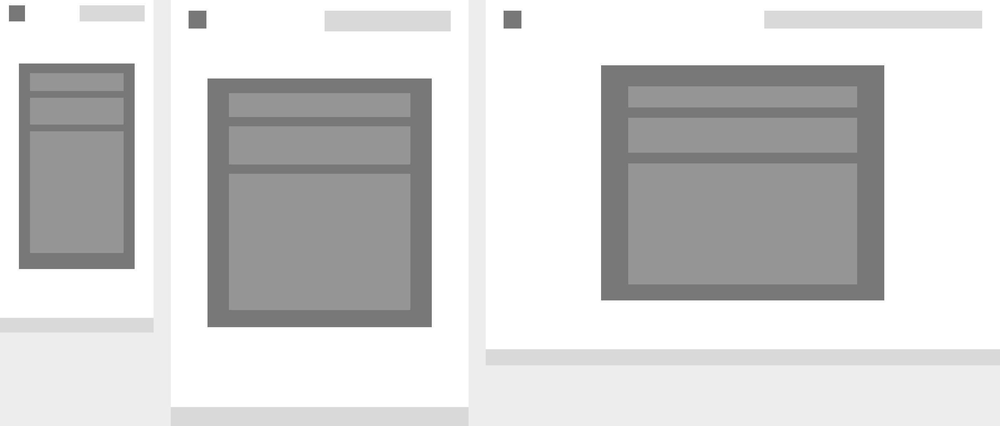

### Changes During Development

Originally, the website was planned to include separate pages for the quiz, instructions, about, and contact sections. However, during development, it was decided to streamline the site into a single-page format. As a result, the quiz is now accessible via the "Start Quiz" button on the home page, while the instructions, about, and contact sections are presented as modals. This change ensures a more cohesive user experience by integrating all content within one page while maintaining the visual layout and functionality as outlined in the initial wireframes.

# Features

## Home Page

- **Totoro character Logo:** The Totoro logo, positioned prominently on the home page, serves as a quick link back to the homepage at any point. Users can click on this logo to restart their experience or return to the main menu, making navigation seamless and intuitive.
- **Navigation Menu:** The navigation menu provides access to key sections, including _Instructions_, _About_, and _Contact_. On mobile devices, the menu transforms into a responsive hamburger icon, making it space-efficient and easy to access. Additionally, the navigation menu remains at the top of the screen during gameplay, ensuring users have immediate access to essential links without disrupting their quiz experience.

|                                  Desktop                                   |                                  Mobile                                  |
| :------------------------------------------------------------------------: | :----------------------------------------------------------------------: |
| 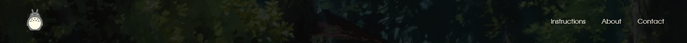 |  |
| 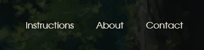 | 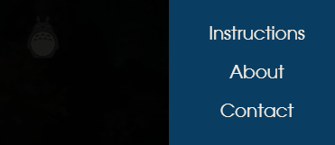 |

- **Modals for Navigation Links:** Clicking on any navigation link opens a corresponding modal containing the relevant information for that section. This design choice allows users to access important information without leaving the page or interrupting the quiz flow.

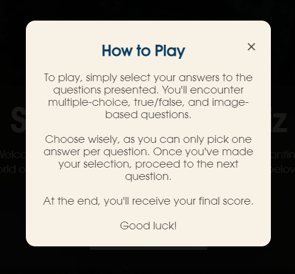

- **Footer:** The footer includes a copyright notice and attribution for the Totoro logo. To keep users focused on the quiz, the footer is hidden once the quiz starts. This minimises on-screen distractions, allowing users to engage fully with the quiz content.

## Quiz

- **Welcome screen:** The welcome screen introduces users to the quiz, displaying the quiz title and a short introduction. The Start button on this screen initiates the quiz, setting up a smooth and guided entry into the quiz interface.

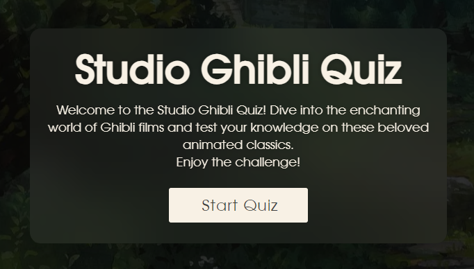

- **Quiz Interface:** The main quiz interface displays each question, along with an image if relevant, to enhance engagement. Users can select answers from multiple-choice options, which are accompanied by a counter showing their current progress (e.g., 3 / 10 Questions). The Next button enables users to proceed only after selecting an answer, helping to prevent accidental skips.

|                                    Desktop                                    |                                   Mobile                                    |
| :---------------------------------------------------------------------------: | :-------------------------------------------------------------------------: |
| 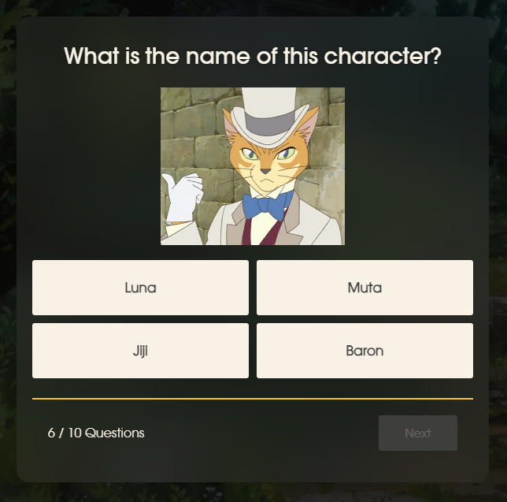 |  |

- **Answer Feedback:** Once an answer is selected, the quiz provides instant feedback by changing the button colour: green for correct answers and red for incorrect ones. If an incorrect answer is chosen, the correct answer button will also turn green, allowing users to learn from their mistakes as they proceed.

|                                Correct Answer                                |                                 Incorrect Answer                                 |
| :--------------------------------------------------------------------------: | :------------------------------------------------------------------------------: |
|  | 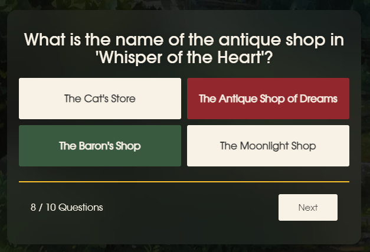 |

- **Quiz Completion Screen:** Upon finishing the quiz, users are directed to a completion screen where they can view their score as a percentage, the total number of correct answers, and a Play Again button for easy restarting. This final screen provides users with a summary of their performance, encouraging repeatability.

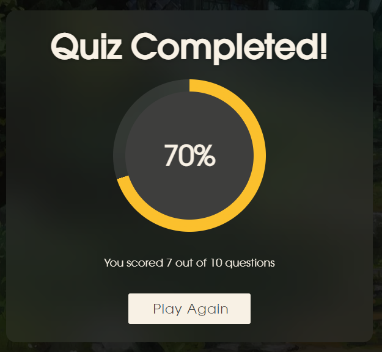

## 404 Page

- **Totoro character Logo:** The 404 page features the same Totoro logo as the home page to maintain visual consistency. However, unlike the main logo, this one does not link back to the home page, keeping the user focused on resolving their navigation error.
- **404 Message Screen:** A clear, friendly 404 message is displayed with an “Oops! Page Not Found!” title, ensuring users understand they’ve encountered an error. Additional text provides a brief explanation, guiding users back to the intended experience.
- **Return Home Button:** A dedicated Return Home button is included, allowing users to easily navigate back to the home page and continue exploring the site. This makes it straightforward for users to recover from the error and re-engage with the quiz.
- **Footer:** The footer includes copyright information and logo attribution, giving the 404 page a complete, professional look that is consistent with other parts of the site.

## Future Features

- **Quiz Timer:** Adding a timer to the quiz to create a time-bound challenge for each question or the quiz as a whole. This feature would add an extra level of difficulty and engagement, encouraging users to think quickly and making each round more exciting.
- **High Scores:** Implementing a high score tracker so users can keep a record of their best scores and aim to beat their previous performance. This feature would offer players a more competitive and goal-oriented experience and encourage repeat engagement with the quiz.

# Manual Testing

## Features Testing

|                    Feature                    |                                          Test case                                           |                                                                                 Outcome                                                                                  |
| :-------------------------------------------: | :------------------------------------------------------------------------------------------: | :----------------------------------------------------------------------------------------------------------------------------------------------------------------------: |
|                     Logo                      |                                    Click the Totoro logo                                     |                                                                          Reloads the home page                                                                           |
|           Nav - Instructions Modal            |                        Click the "Instructions" link in the nav menu                         |          The instructions modal opens, displaying the "How to Play" content. The modal can be closed by clicking the close button or pressing outside the modal          |
|               Nav - About Modal               |                            Click the "About" link in the nav menu                            |             The about modal opens, displaying information about the quiz. The modal can be closed by clicking the close button or pressing outside the modal             |
|              Nav - Contact Modal              |                           Click the "Contact" link in the nav menu                           |         The contact modal opens, displaying a contact message and email link. The modal can be closed by clicking the close button or pressing outside the modal         |
|                Welcome Screen                 | Check the visibility of the title, welcome message, and "Start Quiz" button on the home page |                                       The title, welcome message, and "Start Quiz" button are clearly visible and properly aligned                                       |
|               Start Quiz Button               |                                Click the "Start Quiz" button                                 |                                       The home page content is hidden, and the quiz becomes visible, displaying the quiz interface                                       |
|          Question and Answer Display          |                  View the question and answer buttons when the quiz starts                   |                                             The current question is displayed at the top and answer buttons are shown below                                              |
|            Next Button Activation             |                Attempt to click the "Next" button before selecting an answer                 |                                                      The "Next" button remains disabled until an answer is selected                                                      |
|           Answer a Correct Question           |                        Select the correct answer for a quiz question                         |                     The selected answer is highlighted in Forest Green (#3A5A40), the score increments by one, and the "Next" button becomes enabled                     |
|         Answer an Incorrect Question          |                        Select an incorrect answer for a quiz question                        |                             The selected answer is highlighted in Rusty Red (#92272D), and the correct answer is highlighted in Forest Green                             |
| "Next" button to proceed to the next question |                         Select an answer and click the "Next" button                         |                                                                 The next question is no longer disabled                                                                  |
|            Current Question Count             |                               When the next button is clicked                                |                                    The count updates immediately after the next button is clicked and the next question is displayed                                     |
|               Complete the Quiz               |                    Answer all questions and reach the final score screen                     |                                                    Displays the user's final score with an option to retake the quiz                                                     |
|              "Play Again" Button              |                                Click the "Play Again" button                                 |                                                                            The quiz restarts                                                                             |
|                Footer Content                 |                     Scroll to the bottom of any page and view the footer                     |                                                         The footer is visible and displays the copyright notice                                                          |
|      "Return to Home" button on 404 Page      |                              Click the "Return to Home" button                               |                                                                         Return user to Home Page                                                                         |
|                 Hover Effects                 |                      Hover the mouse over buttons and navigation links                       |                                                  The buttons and links change colour or style, indicating interactivity                                                  |
|              Modal Interactions               |             Open and close each modal using the provided links and close buttons             | Each modal opens when its corresponding link is clicked and closes when the close button is clicked. The background content remains unaffected by the modal interactions |

## Browser Compatibility

| Browser Tested | Intended Appearance | Intended Responsiveness |
| :------------: | :-----------------: | :---------------------: |
|     Chrome     |        Good         |          Good           |
|     Safari     |        Good         |          Good           |

## Responsiveness Testing

|    Device Tested    | Site responsive >= 700px | Site responsive < 699px> | Renders as expected |
| :-----------------: | :----------------------: | :----------------------: | :-----------------: |
|  iPhone 14 Pro Max  |           N/A            |           Good           |        Good         |
| Samsung Galaxy S8 + |           N/A            |           Good           |        Good         |
|      iPad Air       |           Good           |           N/A            |        Good         |
|   MacBook Air 13"   |           Good           |           N/A            |        Good         |
|     23" monitor     |           Good           |           N/A            |        Good         |

## Accessibility Testing

### WAVE Web Accessibility Evaluation

As part of my Web Accessibility Evaluation using the WAVE tool, I encountered one alert regarding a redundant link in the navigation menu. The tool flagged that the Home link and the logo both directed to the same URL, with the message "Adjacent links go to the same URL." Since the logo is already linked to the homepage and the site is a one-page layout, I decided to remove the Home link from the navigation menu entirely, deeming it unnecessary. This adjustment resolved the alert and improved the overall accessibility of the site.

## Code Validation

### HTML Validator

To ensure the correctness of the HTML code, I used the W3C HTML Validator. The validation process revealed no errors in the HTML code across all pages of the website. This confirms that the HTML is properly structured and adheres to web standards.

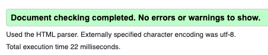

### CSS Validator

For CSS validation, I utilised the W3C CSS Validator. The CSS code was thoroughly checked, and no errors were found. This indicates that the CSS is correctly formatted and conforms to the established CSS standards.

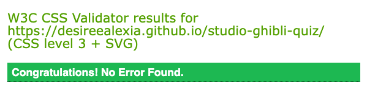

## Bugs

### Font Loading Issue

The website's fonts were not loading as intended, causing fallback fonts to appear and affecting the visual consistency and design integrity of the site. This potentially altered the user experience by displaying text differently than originally designed.

To resolve the issue, the file structure was verified to ensure that the font files were correctly placed relative to the CSS file, and the `@font-face` declarations in the CSS were updated with accurate relative paths. The site was tested across environments, with a hard refresh performed in the browser to clear the cache and confirm the correct font loading. The fonts now load as expected, ensuring the visual design consistency across all pages, and the issue has been fully resolved.

### Backdrop Not Appearing When Toggling Menu

When clicking the burger icon to toggle the menu, the backdrop did not appear even though it was being created and toggled in JavaScript. Without the backdrop, users wouldn’t have visual feedback when the menu opens, and interactions with elements behind the menu could diminish the usability of the menu experience. The problem was that I toggled a class named `display` in JavaScript but didn’t define the behaviour of the `.display` class in the CSS. To resolve this, I added a `.display` class in CSS that sets the `display` property of the backdrop to `block` when toggled on.

The backdrop now appears when toggling the menu.

### Backdrop Overlapping Menu Items

After fixing the backdrop, it appeared, but the menu items were hidden behind the backdrop. This occurred because the `z-index` of the backdrop was set too high, causing it to layer over the menu.The menu became unusable as the backdrop completely covered the menu items, preventing the user from seeing or interacting with them. The issue was fixed by ensuring the `z-index` of the menu items (`.nav-links`) was higher than the `z-index` of the backdrop. Additionally, I set the position property of the `.nav-links` to relative so that the `z-index` would apply correctly.

The menu is now fully visible and functional, sitting above the backdrop. The backdrop no longer interferes with the menu items, which ensures smooth interaction.

### Menu Items Visible on Right Side When Navigation is Closed

The menu items were sitting on the right side of the screen even when the navigation was closed. This occurred because the positioning of the menu was not properly defined, causing the menu to remain partially visible on the screen when it should have been hidden. This issue affected the site’s usability and appearance, as the menu was still visible on the right side of the screen when it should have been fully hidden off-screen, disrupting the layout and user experience. The issue was fixed by changing the `position` of the `.nav-links` to `fixed` in CSS. This ensures the menu is positioned relative to the viewport and allows it to be fully moved off-screen when not in use.

### Button Colour Feedback

When users select an answer in the quiz, the buttons do not consistently display the correct background colour for correct or incorrect responses. This can lead to confusion, as users may not see whether their selection was right or wrong. The CSS selectors for the `.correct` and `.incorrect` classes were updated to increase specificity. The selectors were modified to `#answer-buttons .correct` and `#answer-buttons .incorrect`, ensuring they properly target the answer buttons within the quiz container. This change successfully resolved the issue. The buttons now correctly reflect the appropriate background colour based on the user's selection, enhancing the overall user experience.

### Hover Effect Persists on Disabled Next Button

The next button retains the hover effect when disabled, causing it to change to a blue background even though it should appear grey (indicating it's not clickable). This bug affects the user experience by misleading users into thinking they can interact with the disabled next button. When the button is disabled, the expected behaviour is that it should not show any hover effects, making it clear that the button cannot be clicked. To fix this issue, I added a new CSS rule that specifies the appearance of the button when it is disabled. The following rule was added:

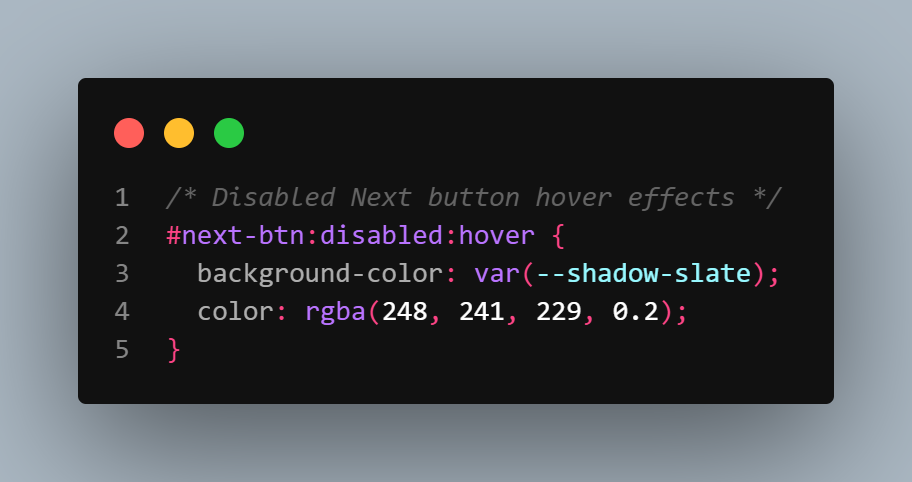

This ensures that the button does not show any hover effects when it is disabled. The issue was resolved successfully. The disabled next button now appears grey without any hover effects, clearly indicating that it is not clickable.

### Unfixed Bugs

There are no unfixed bugs.

## Lighthouse Testing

### Home Page (index.html)

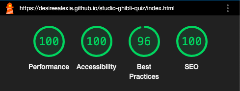

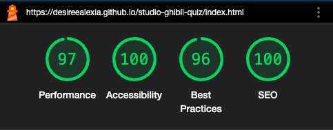

### 404 Page (404.html)

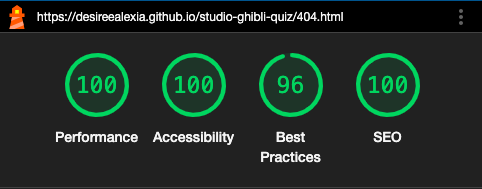

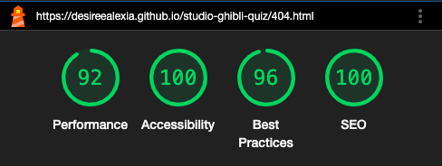

# Deployment

## Deployment (GitHub Pages)

This website was deployed using GitHub pages. Here are the steps of deployment:

1. Log in to GitHub and locate the [studio-ghibli-quiz](https://github.com/desireealexia/studio-ghibli-quiz) repository
2. Under the repository name, click **Settings**
3. In the "Code and automation" section on the left sidebar, click **Pages**
4. Under "Build and deployment", in the "Source" section, select _Deploy from a branch_
5. Use the branch dropdown menu to select _main_, ensuring that the _root_ folder is also selected
6. Save these settings
7. Under the repository name, click **Code**
8. Wait a few minutes and refresh the page
9. A "Deployments" section will appear on the right sidebar. Click the GitHub Pages link, which will open the deployed site
10. Click on the link to be taken to the live site

## Local Deployment

1. Log in to GitHub and locate the [studio-ghibli-quiz](https://github.com/desireealexia/studio-ghibli-quiz) repository
2. Click the green button that says **Code** and click **Local**
3. To clone the repository using HTTPS, copy the provided link
4. In your terminal, type `git clone` and then paste the link
5. Press Enter, and your local clone will be created

# Technologies Used

## Languages

HTML5, CSS3 and JavaScript

## Design & Development Tools

- **[Figma](www.figma.com):** Used for creating wireframes and planning the layout and structure of the website.
- **[Coolors](https://coolors.co/):** Assisted in generating and refining the colour palette for the website, ensuring a cohesive and visually appealing design.
- **[Accessible Colour Palette Builder](https://toolness.github.io/accessible-color-matrix/)**: Assisted in selecting a colour palette that is both visually appealing and accessible to users with colour vision deficiencies.
- **[WebAIM Contrast Checker](https://webaim.org/resources/contrastchecker/)**: Ensured that text and background colour combinations meet accessibility standards for readability.
- **[Cloud Converter](https://cloudconvert.com/ttf-to-woff2):** Converted font files from `.ttf` to `.woff` and `.woff2` formats to ensure better browser compatibility and performance.
- **[TinyPNG](https://tinypng.com/):** Compressed images to reduce file size and improve loading times without compromising quality.
- **[Visual Studio Code](https://code.visualstudio.com/):** This Integrated Development Environment (IDE) was the primary tool for writing and editing the HTML and CSS code. The use of extensions like Prettier or code formatting and Live Server for real-time previews significantly enhanced the development workflow.
- **[Git](https://git-scm.com/):** Employed for version control, allowing for the tracking of changes in the project's codebase; ensuring that the development process was organised.
- **[GitHub](https://github.com/):** The project code was stored in a GitHub repository.
- **[GitHub Pages](https://pages.github.com/):** Used to deploy the website, making it accessible to users online.
- **[WAVE Web Accessibility Evaluation Tool](https://wave.webaim.org/):** Used for evaluating the website’s accessibility, which led to the identification and resolution of the redundant link issue.
- **[W3C Markup Validation Service](https://validator.w3.org/):** Used to check the validity of HTML code and ensure compliance with web standards.
- **[W3C CSS Validation Service](https://jigsaw.w3.org/css-validator/):** Used to validate CSS and ensure proper formatting and adherence to standards.

# Credits

## Code

- **YouTube Tutorials:** [GreatStack](https://www.youtube.com/watch?v=PBcqGxrr9g8) and [Codehal](https://www.youtube.com/watch?v=Vp8x8-reqZA&t=1946s) tutorials used to guide the development of quiz structure and functionality.

- **HTML, CSS and JavaScript code for Modal:** Adapted code for creating modals from [W3Schools](https://www.w3schools.com/howto/howto_css_modals.asp).

- **CSS Web Fonts:** Learned how to use `@font-face` for custom CSS web fonts from [W3Schools](https://www.w3schools.com/css/css3_fonts.asp).

- **CSS var() Function and :root Usage:** Information on using CSS variables and `:root` for theming on [W3Schools](https://www.w3schools.com/css/css3_variables.asp).

- **Glassmorphism:** Adapted code from the [Glassmorphism CSS Generator](https://css.glass).

- **Responsive Navigation Bar:** Adapted code from [Medium](https://volodymyrzh.medium.com/building-a-responsive-navigation-bar-with-css-593ffdb26887) article to guide the creation of a responsive navigation menu to enhance usability on various devices from.

- **Button Disabled Attribute:** [W3Schools](https://www.w3schools.com/tags/att_button_disabled.asp) provided knowledge on managing button states to improve user interaction.

- **Button Disabled Property:** [W3Schools](https://www.w3schools.com/jsref/prop_pushbutton_disabled.asp) formed the functionality of disabling buttons in certain states to prevent user errors.

## Research and Resources

- **Font Information:** The name of the font used in the Studio Ghibli logo was identified from [Wikimedia Commons](https://commons.m.wikimedia.org/wiki/File:Studio_Ghibli.png). Fonts used in the project were obtained from the [BBH Labs GitHub repository](https://github.com/bbh-labs/anti-social/tree/master/www/font/ITC%20Avant%20Garde%20Gothic).

## Media

### Images

- **Logo and Favicon:** The Totoro logo and favicon icons are provided by [Icons8](https://icons8.com/icon/6n6VZ02KZwP1/totoro).

- **Background:** The background image used on the website is sourced from [This Is Colossal](https://www.thisiscolossal.com/2020/09/studio-ghibli-animations/). This site features a collection of Studio Ghibli animations that inspired the selection of the background image for this project.

- **Question Images:** The image featuring the robot from Castle in the Sky is from [Drifting Back Around](https://driftingbackaround.home.blog/2019/09/18/30-years-castle-in-the-sky-robots/) and the image depicting Humbert von Gikkingen (The Baron) from The Cat Returns. is sourced from [Ghibli Fandom](https://ghibli.fandom.com/wiki/Humbert_von_Gikkingen).

## Content

- **Written Content:** Created by the developer with assistance from ChatGPT.
